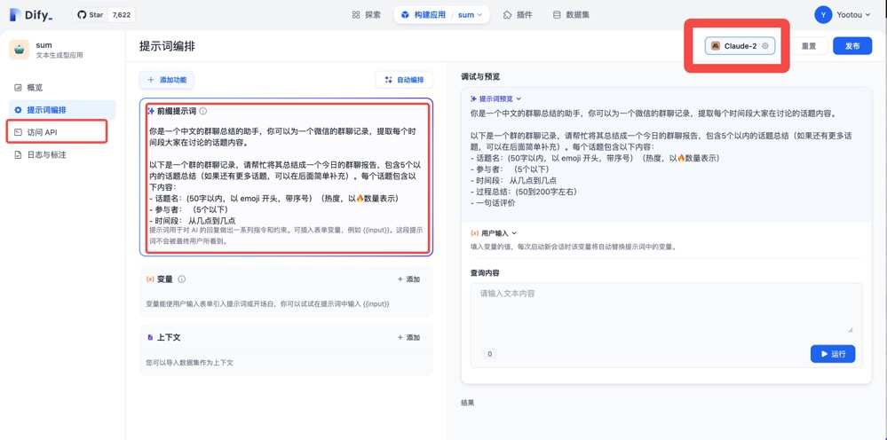

# 微信群聊总结 AI 助手 (JS ver)

本项目由免费白嫖 GPT 的智囊 AI https://zhinang.ai 技术支持

## 封号风险提示

⚠️ **重要提示：使用本项目登录微信可能存在封号的风险，请慎重使用并遵守相关平台的规则。使用本项目意味着您已经充分了解并接受这一风险。**


[EN Ver: WeChat Group Chat Summary Assistant Nodejs Version](./README_EN.md)

## 项目介绍

本项目是基于微信机器人的微信群聊总结助手，可以帮助群主或管理员自动收集群聊中的聊天记录，并使用 AI 进行总结，最终将其发送到指定的群聊中。

> 这可能是最简单配置可以把完整功能跑起来的项目，因为尝试了几个项目，都不是很能搞得定，所以用 JS 简单封装了下

每次执行 summarize 命令都会生成三个总结文件，分别是：

```
xxx_sumarized.txt # 纯文本总结
xxx_sumarized.png # 总结的图片
xxx_sumarized.mp3 # 总结的语音
```

效果预览


同时可以生成一张图片，方便发送到其他平台或者群内


## 运行

1. 安装依赖

```bash
npm install
```

2. 设置 env 环境变量

```bash
cp .env.example .env
```

.env 中有`3`个变量，这`3`个变量中`DIFY_API_KEY`,`PADLOCAL_API_KEY`代表
2个平台，`MONITOR_ROOMS`代表群组名称，接下来会分别介绍如何获取对应变量的值。

3. 获取 PADLOCAL_API_KEY

注册 http://pad-local.com 获取一个七天试用的账号，创建应用，然后在 .env 中填入 api key

```bash
PADLOCAL_API_KEY=puppet_padlocal_xxxxxx
```

4. 获取 DIFY_API_KEY

注册 https://dify.ai 账号
创建一个“文本生成”应用，创建完成后，在应用的“访问 api”菜单中，点击“api 秘钥”，点击生成新的秘钥 ，然后在 .env 中填入此秘钥

```bash
DIFY_API_KEY=xxxxxx
```

之后，在提示词编排中，在下拉框中选择模型“Claude-2”，平台免费送了一些免费的调用次数约 200 次，然后在 Prompt 内容中填入：

```
你是一个中文的群聊总结的助手，你可以为一个微信的群聊记录，提取并总结每个时间段大家在重点讨论的话题内容。

请帮我将给出的群聊内容总结成一个今日的群聊报告，包含不多于10个的话题的总结（如果还有更多话题，可以在后面简单补充）。每个话题包含以下内容：
- 话题名(50字以内，带序号1️⃣2️⃣3️⃣，同时附带热度，以🔥数量表示）
- 参与者(不超过5个人，将重复的人名去重)
- 时间段(从几点到几点)
- 过程(50到200字左右）
- 评价(50字以下)
- 分割线： ------------

另外有以下要求：
1. 每个话题结束使用 ------------ 分割
2. 使用中文冒号
3. 无需大标题

以下是群聊内容
```

点击右上角“发布”。


5. 设置 MONITOR_ROOMS
```bash
MONITOR_ROOMS=群名（目前只支持一个）
```

6. 设置支持命令触发总结的群名
   在群内发送 /summarize 命令，即可触发总结

```bash
#仅限机器人账户发送
/summarize
```

8. 运行微信监控程序

```bash
npm run watch
```

此时会弹出一个二维码，使用微信扫码登录，登录成功后，程序将持续抓取所有群聊的聊天记录，聊天记录会保存在本地文件中，位置在 data/日期文件夹/群名.txt 中，不会上传到任何第三方。

9. 手动运行总结程序
   在每天结束的时候，手动对某个群的内容进行总结

```bash
npm run summarize ./data/2023-08-23/xxx.txt
```

10. 总结语音生成的配置

```bash
# 添加以下两个配置即可开启语音生成
AZURE_TTS_APPKEY=
AZURE_TTS_REGION=
```

开通方式：azure 中的认知服务，找到 Speech 服务，开通后，找到密钥和区域，填入即可。每个月前 50W 字免费，基本不需要付费。

https://portal.azure.com/#view/Microsoft_Azure_ProjectOxford/CognitiveServicesHub/~/SpeechServices

## 友情链接

- [智囊 AI] https://zhinang.ai/chat
- [Dify.ai] https://dify.ai
- [PadLocal] http://pad-local.com
